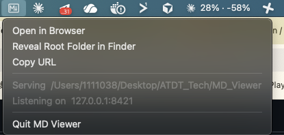

# mdviewer — Web · Menubar · TUI Markdown Viewer

브라우저 기반 웹 뷰어 + macOS 메뉴바 자동 실행 + 터미널 TUI까지, **한 바이너리에서 세 가지 모드**로 마크다운을 탐색·편집할 수 있는 뷰어입니다.

- **Web (권장)** — `http://127.0.0.1:8421/` · 파일 탐색, Preview/Edit/Split, 검색, 메모, 아웃라인, Mermaid, 수식, 테마, 자가 업데이트
- **Menubar** — 로그인 시 자동 시작, 메뉴바 클릭으로 브라우저 열기 + `.md` 더블클릭 연동
- **TUI** — `bubbletea + glamour` 기반 터미널 모드

---

## 🚀 빠른 설치 (macOS 메뉴바 앱)

```bash
git clone https://github.com/neo2544/mdviewer.git
cd mdviewer
scripts/install.sh            # 이 한 줄이면 끝 (Xcode CLT 필요)
```

`install.sh`가 하는 일:

- ✅ 버전 정보를 심어 `mdviewer` 바이너리 빌드
- ✅ `~/Applications/MdViewer.app` 메뉴바 앱으로 등록 (`LSUIElement` — Dock에는 안 뜸)
- ✅ LaunchAgent 등록 — 로그인 시 자동 시작 + 죽으면 재시작
- ✅ `.md` / `.markdown` / `.mdx` 더블클릭 → 바로 브라우저에서 열림 (Apple Event 연동)
- ✅ `http://127.0.0.1:8421/` 가 항상 떠 있음

옵션 / 제거:

```bash
scripts/install.sh --root ~/Documents --port 8421   # 다른 루트 폴더 / 포트
scripts/install.sh --help                            # 전체 옵션
scripts/uninstall.sh                                 # 제거
```

메뉴바 아이콘(M↓) 클릭 시:



- **Open in Browser** / **Reveal Root Folder in Finder** / **Copy URL**
- **Version · Check for Updates · ⬆ Update & Restart** — 새 버전이 있으면 메뉴에서 바로 업데이트
- **Quit MD Viewer**

로그: `~/Library/Logs/MdViewer/mdviewer.{out,err}.log`

---

## ✨ 주요 기능 (웹)

### 파일 탐색
- 좌측 사이드바 파일 브라우저, **Recent files / Recent folders / Favorites**
- **즐겨찾기 드래그 정렬** — 항목 왼쪽 `⠿` 핸들을 끌어 순서 변경 (사이드바·전체 목록 모달), 별칭(alias) 지정
- **경로 점프** — `Cmd/Ctrl+L` 또는 사이드바 "Jump to path" (절대/상대/`~` 지원)
- **하위 폴더 탐색 모달** — 파일명으로 빠르게 찾기, `하위 폴더 / Git repo` 범위 토글 (Git 저장소가 아니면 비활성)

### 미리보기 & 편집
- **Preview / Edit / Split** 3-모드, `⌘S` 저장, 헤더의 파일명 클릭 시 경로 복사
- 마크다운 렌더링 + **코드 신택스 하이라이트**(코드블록 복사 버튼), 이미지 라이트박스
- **테마** 토글 — Auto / Light / Dark

### 검색 (Search 탭)
- **In this file** — 현재 문서 내 검색, `Line / Priority`(헤딩 우선) 정렬, 줄 번호 표시
- **Same folder / Git repo** — 같은 폴더(얕은) ↔ 상위 Git 저장소 전체(재귀) 범위 토글, 진행 중 로딩 표시

### 아웃라인 (Outline 탭)
- 문서 헤딩 목록 + 클릭 점프, **스크롤 스파이**(현재 위치 자동 강조)
- **레벨 제한 토글** — `H1–2 / H1–3 / All`, 헤딩이 많아도 또렷하게(스크롤)

### 메모 노트북 (Memo 탭)
- **다중 메모** — `＋ New`로 추가, 카드형 리스트(제목/첫 줄·수정시간·출처 표시), **검색 필터 · 정렬(Updated/Created/Title) · 핀 고정**
- **서버 파일 동기화** — `.mdviewer_memos.json`에 저장, 새 세션에서도 유지. 다른 세션 변경은 자동 반영, **충돌 시 팝업**(내 버전 / 서버 버전 / 둘 다 보관)
- **선택 → 메모/복사** — 본문 드래그 시 `📝 메모 / 📋 복사` 플로팅 버튼. 메모에는 **출처 백링크**가 남고, 클릭하면 그 위치로 이동 + 해당 문장 하이라이트
- **복사** — 제목이 있으면 출처 링크 형태로 복사

### Mermaid & 다이어그램
- 코드블록의 `mermaid` 자동 렌더, 클릭 시 라이트박스 확대
- **Mermaid Playground** (헤더 🧪) — 붙여넣어 라이브 렌더, 그리기 주석 · **포스트잇** · PNG 저장. `$E=mc^2$` 같은 **수식 입력도 자동 판별**해 렌더

### 수식 (KaTeX)
- 본문의 `$…$`, `$$…$$`, `\(…\)`, `\[…\]` 를 렌더 (코드블록은 제외)

### 버전 & 자가 업데이트
- 헤더 우측 / 사이드바 하단에 **현재 버전**(브랜치 + 짧은 해시) 표시 — **호버하면 최근 커밋 로그(날짜·제목)** 확인
- 원격(origin)에 새 커밋이 있으면 **`⬆ Update (N)`** 버튼 → 클릭 시 `git pull --ff-only → 빌드(버전 재임베드) → 바이너리 교체 → 자동 재시작`
- 설치된 메뉴바 앱도 자가 업데이트 동작(빌드 시 심긴 소스 체크아웃에서 빌드 후 같은 PID로 재실행) — 단 이 기능이 든 버전으로 한 번 재설치한 이후부터
- `go run`(`run.sh`/`run-web.sh`)은 버전 표시만, 자가 업데이트는 비활성(임시 바이너리)

---

## 실행 모드

| 모드 | 명령 | 설명 |
|---|---|---|
| TUI | `mdviewer [path]` | 터미널 안에서 직접 탐색 |
| Web | `mdviewer --web [--port 8421] [--root <dir>]` | 로컬 웹 서버 |
| Menubar | `mdviewer --menubar [--port 8421] [--root <dir>]` | 메뉴바 아이콘 + 웹 서버 |

> 자가 업데이트를 쓰려면 **저장소 안에서 빌드한 바이너리**(또는 `install.sh`로 설치한 앱)로 실행해야 합니다.

## 빌드 & 개발 실행

```bash
go mod tidy
go run .                  # 현재 폴더 (TUI)
go run . ~/Documents      # 특정 폴더
./run-web.sh [path]       # 웹 모드 (go run)
go build -o mdviewer .    # 빌드
./mdviewer --web .        # 빌드 바이너리로 웹 실행 (자가 업데이트 가능)
```

## TUI 단축키

| 키 | 동작 |
|---|---|
| `↑`/`k`, `↓`/`j` | 목록/미리보기 이동 |
| `Enter` | 디렉터리 열기 |
| `Tab` | 목록 ↔ 미리보기 포커스 |
| `PgUp`/`PgDn`, `Home`/`End` | 미리보기 스크롤 |
| `g` 또는 `:` | 경로 점프 모드 |
| `q` / `Ctrl+C` | 종료 |

## 미리보기 지원 형식

- **Markdown** (`.md`, `.markdown`, `.mdx`)
- **텍스트/코드** (`.txt`, `.go`, `.py`, `.js`, `.ts`, `.sh`, `.yaml`, `.json`, `.toml` 등)
- 이미지 · Mermaid · 기타는 형식에 맞게 표시

---

## 구조

```
mdviewer/
├── main.go                # 엔트리포인트 · 플래그 파싱 · TUI (bubbletea)
├── web.go                 # 웹 서버 + 임베드된 HTML/CSS/JS (단일 페이지 앱)
├── menubar.go             # 메뉴바 앱 (systray) + 자가 업데이트
├── menubar_darwin.{go,m}  # macOS Apple Event(.md 열기) 핸들러
├── assets/                # 메뉴바 아이콘 등
└── scripts/               # install.sh · uninstall.sh
```

런타임 데이터(루트 폴더에 저장): `.mdviewer_favorites.json` · `.mdviewer_aliases.json` · `.mdviewer_memos.json`

## 의존 패키지

```
github.com/charmbracelet/bubbletea / bubbles / lipgloss / glamour   — TUI · 렌더링
fyne.io/systray                                                     — 메뉴바 아이콘
```
웹 프론트엔드는 marked.js · highlight.js · mermaid · KaTeX 를 CDN으로 로드합니다.
