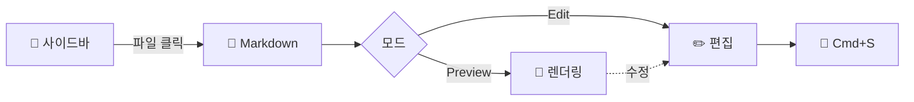

# 📘 Markdown Browser — Welcome

> 좌측에서 파일을 골라 **읽고·편집하고·다이어그램을 보는** 마크다운 뷰어입니다.
> 이 안내는 파일이 선택되지 않았을 때 표시됩니다. 👋

---

## ⚡ 단축키

| 키 | 동작 |
|----|------|
| `Cmd/Ctrl + K` | 빠른 열기 (Recent 팔레트) |
| `Cmd/Ctrl + L` | 경로로 점프 |
| `Cmd/Ctrl + S` | 저장 (편집 모드) |
| `Cmd/Ctrl + Shift + .` | 숨김 파일 토글 |
| `Esc` | 팔레트·팝업 닫기 |
| `Alt/Option + 드래그` | Mermaid 텍스트 선택 |

---

## 🗂️ 핵심 기능

- **탐색** — 사이드바에서 파일·폴더 클릭, `..` 로 상위. *Search files* 로 필터, *Jump to path* 로 경로 점프.
- **Recent / Favorites** — 사이드바엔 최대 3개만 노출, **Show all** 로 전체 보기. ⭐ **Toggle current** 로 현재 폴더를 즐겨찾기에 추가하고, 행을 **드래그해 순서 변경**하거나 **✎** 로 별칭을 붙일 수 있어요 (별칭은 서버 저장 → 기기 공유).
- **변경 알림** — 파일명 옆 컬러 점: 🟦 new · 🟪 updated · 🟨 recent · ⭕ 자식 변경. 한 번 열면 사라집니다.
- **미리보기** — Markdown 렌더, 이미지(클릭 시 라이트박스), sandbox `iframe` HTML, 텍스트/코드 원문.
- **편집** — 우측 상단 **Edit** → `Cmd/Ctrl + S` 저장. 외부 변경과 충돌하면 경고합니다.
- **테마** — 우측 상단 버튼으로 ◐ Auto → ☀ Light → 🌙 Dark 순환 (선택은 유지됨).

---

## 🎯 Mermaid 다이어그램

호버하면 **Copy text**, 클릭하면 라이트박스로 확대됩니다. 라이트박스에선 **💾** 로 PNG 저장, 하단 툴바로 주석을 그릴 수 있어요. 확대 상태에서 휠 줌·드래그 이동, 더블클릭으로 리셋.

아래가 보이면 mermaid 가 정상 동작하는 것입니다:



---

## 🤖 다른 모드

```bash
mdviewer            # TUI 모드 (기본, ? 로 도움말)
mdviewer --web      # 지금 이 웹 모드
mdviewer --menubar  # macOS 메뉴바 모드
```

*Happy reading!* 📖✨
