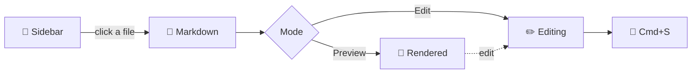

# 📘 Markdown Browser — Welcome

> A markdown viewer to **read, edit, and view diagrams** — pick a file on the left.
> This guide is shown whenever no file is selected. 👋

---

## 🗂️ Core features

- **Browse** — click files/folders in the sidebar, `..` to go up. Filter with *Search files*, jump with *Jump to path*.
- **Recent / Favorites** — the sidebar shows up to 3; **Show all** reveals the rest. ⭐ **Toggle current** adds the current folder to favorites; **drag rows to reorder** or **✎** to set an alias (aliases are saved on the server → shared across devices).
- **Change badges** — colored dots next to filenames: 🟦 new · 🟪 updated · 🟨 recent · ⭕ child changed. They clear once you open the file.
- **Preview** — rendered Markdown, images (click for a lightbox), sandboxed `iframe` HTML, raw text/code.
- **Edit** — top-right **Edit** → `Cmd/Ctrl + S` to save. You're warned if an external change conflicts.
- **Theme & accent** — cycle ◐ Auto → ☀ Light → 🌙 Dark, and pick your own accent color (🎨). Choices persist.
- **Language** — auto-detected from your browser (English / 한국어); switch anytime with the EN/한 toggle in the header.

---

## 🔧 Git-aware features

- **Version** — for files in a git repo, compare any two revisions side by side with a synchronized, color-coded diff (added = green, removed = red), jump between changes, and zoom diagrams.
- **Changes** — toggle an inline "what changed since the last version" overlay right in the preview: additions in green, deletions in red strikethrough.
- **AI-DLC** — when the repo root has an `aidlc-docs` folder, list every doc under it (newest first).

---

## ⚡ Keyboard shortcuts

| Key | Action |
|-----|--------|
| `Cmd/Ctrl + K` | Quick open (Recent palette) |
| `Cmd/Ctrl + L` | Jump to path |
| `Cmd/Ctrl + S` | Save (edit mode) |
| `Cmd/Ctrl + Shift + .` | Toggle hidden files |
| `Esc` | Close palette / popups |
| `Alt/Option + Drag` | Box-select diagram text (in the lightbox) |

---

## 🎯 Mermaid diagrams

Hover to **Copy text**, click to open the lightbox. In the lightbox, **💾** saves a PNG and the bottom toolbar lets you annotate. While zoomed: wheel to zoom, drag to pan, double-click to reset.

If you can see the diagram below, mermaid is working:

---

## 🕘 Version history (highlights)

- **Git version compare** — side-by-side revision diff with synced scrolling, change navigation, table/code/mermaid-aware highlighting, and intra-line (character-level) emphasis.
- **Inline "Changes" overlay** — see edits since the last version directly in the preview.
- **Rendered-content search** — the in-file search matches the rendered text, even across inline markup (bold/code).
- **Memo trash** — deleted memos go to a recoverable trash with restore / empty.
- **Mermaid box-select** — ⌥+drag a region in the lightbox to copy its text, with a selection highlight.
- **AI-DLC mode** — one flat, time-sorted view of every `aidlc-docs` file, labeled by subfolder.
- **Accent color & i18n** — pick the app's accent color; English / 한국어 by browser language with a manual toggle.

---

*Happy reading!* 📖✨
